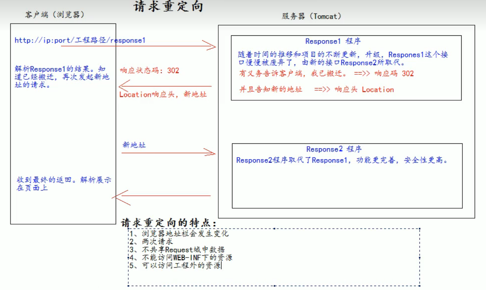

### 前言
对javaee的理解：
（1）javaee就是定义了一批java语言企业开发需要的技术规范，参考下图

（2）以tomcat举例，tomcat就是一个javaee的web container的部分技术规范的应用实例，
tomcat可以说是servlet的容器，也有其它实现了javaee的技术规范的容器，比如jetty

### 说明
1、什么是javaweb？
javaweb是指，所有通过java语言编写可以通过浏览器访问的程序的总称，叫javaweb
javaweb是基于请求和响应来开发的

2、什么是请求？
请求是指客户端给服务器发送数据，叫请求request

3、什么是响应？
响应是指服务器给客户端回传数据，叫响应response

### Servlet
什么是Servlet？
1、Servlet是Java EE的规范之一，规范就是接口
2、Servlet是JavaWeb三大组件之一，三大组件为：Servlet、Filter过滤器、Listener监听器
3、Servlet是运行在服务器上的一个Java小程序，它可以接收客户端发送过来的请求，并响应数据给客户端。

Servlet的实现步骤：
（1）编写一个类去实现Servlet接口
（2）实现Service方法，处理请求并响应数据
（3）到web.xml中配置Servlet的访问地址

HTTP:
1、GET请求
请求行：
（1）请求的方式：GET
（2）请求的资源路径：/xxx/xxx
（3）请求的协议的版本号 HTTP/1.1
2、响应行
（1）响应的协议和版本号：HTTP/1.1
（2）响应状态码：200
（3）响应状态描述符：OK

forward
请求转发的特点：
1、浏览器地址栏没有变化
2、他们是一次请求
3、他们共享request域中的数据
4、可以转发到WEB-INF（受保护的目录）下
5、不可以访问工程以外的资源

web中的相对路径与绝对路径
相对路径：
.         => 表示当前目录
..        => 表示上一级目录
资源名     => 表示当前目录/资源名 

绝对路径
http://ip:port/工程路径/资源路径

web中 / 的不同意义
在web中 / 是一种绝对路径

请求重定向：
是指客户端给服务器发请求，然后服务器告诉客户端说，我给你一些地址，你去新地址访问，叫请求重定向（之前的地址可能已经废弃）

javaEE的三层架构

分层的目的是让代码解耦，方便项目的后续维护和升级。

### JSP
jsp全称是java server pages，java的服务器页面
jsp的主要作用是代替Servlet程序回传html页面的数据
因为Servlet程序回传html页面是一件很繁琐的事情，开发和维护成本都很高
本质：就是一个servlet程序
原理：当我们第一次访问jsp页面的时候，Tomcat服务器会帮我们把jsp页面翻译成java源文件，并进行编译。
《HttpJspBase extends HttpServlet》

静态包含：
<%@ include ...%>
原理：
1、静态包含不会翻译被包含的jsp页面
2、静态包含其实是把被包含的jsp页面的代码拷贝到包含的位置执行输出（out.write(...)）

动态包含：
<jsp:include page="/..."/>
原理：
1、动态包含会把包含的jsp页面翻译成java代码
2、动态包含底层代码会使用java语句来调用被包含的页面
JspRuntimeLibrary.include(request, response, "/xxx", out, false);

EL表达式是为了替换jsp页面中的表达式语句(<%= xxx %>)，JSTL表达式

Listener监听器？
1、是JavaWeb三大组件之一。
2、是javaee的规范，就是接口
3、作用：监听某种事物的变化，通过回调函数，反馈给客户程序做一些相应的处理
关键的接口：ServletContextListener
ServletContextListener可以监听ServletContext（web工程启动和停止的时候创建与销毁）的创建与销毁。
怎么使用监听器？
（1）实现ServletContextListener接口
（2）实现其两个回调方法
（3）到web.xml中去配置监听器

### 文件的上传
1、form标签，method=post
2、form标签的encType属性值必须为multipart/form-data值
3、在form标签中使用 input type="file"添加上传的文件
4、服务器处理

### Cookie和Session
Cookie是服务器通知客户端保存键值对的一种技术
客户端有了cookie有，每次发送请求可以传输cookie
每个cookie大小不能超过4kb

cookie免输用户名登陆
实现逻辑：当用户登陆成功之后，将用户名放入到cookie中，下次再进入网页时，
用户名将使用cookie里面的用户名进行回显。

session：session是一个接口（HttpSession）
session就是会话，用来维护客户端与服务器之间关联的技术
每个客户端都有自己的session会话
session会话中，我们经常用来保存用户登陆之后的信息

session的生命周期控制：
public void setMaxInactiveInterval(int interval)
设置session的超时时间（以秒为单位），超过指定的时长，session就会被销毁
public int getMaxInactiveInterval()
获取session的超时时间
session超时时间的配置
超时的概念：客户端与服务器两次请求的最大间隔时长
（1）session默认的超时时长为30分钟。
（2）可以在web.xml中进行配置（整个项目的session都使用此配置）
（3）单独某个session配置setMaxInactiveInterval（负数表示永不超时）
Session是基于Cookie的技术来实现的

Filter过滤器
1、是JavaEE的规范，是一个接口
2、作用：拦截请求，过滤响应
常见的应用场景：
（1）权限检查
（2）日记操作
（3）事务管理

Filter拦截器的使用步骤
（1）编写一个类，实现Filter接口
（2）重启Filter接口中的doFilter()方法，写上过滤的代码逻辑
（3）web.xml中编写要过滤的资源的配置

Filter的生命周期：
1、构造器方法
2、init初始化方法
3、doFilter方法
4、destory销毁方法

FilterChain：过滤链

表单的重复提交三种解决办法：
（1）使用重定向的方法
（2）使用验证码（服务器延迟造成的重复提交或浏览器回退导致的重复提交）

ThreadLocal的使用：
用于解决线程安全问题的工具类
作用：可以解决多线程的数据安全问题
ThreadLocal可以给当前线程关联一个数据（普通变量、也可以是对象，数组、集合）
ThreadLocal的特点：
        1、可以为当前关联一个数据（可以向Map一样存取数据，key为当前线程）
        2、每一个ThreadLocal对象，只能为当前线程关联一个数据，
        如果要为当前线程关联多个数据，就需要使用多个ThreadLocal实例
        3、每个ThreadLocal对象定义的时候，一般都为static类型，
        4、ThreadLocal保存的数据，在线程销毁后，会由JVM虚拟机自动释放
使用场景：
可以使用ThreadLocal对象，确保所有操作都使用同一个Connection对象。
前提条件是，所有操作都必须在同一个线程完成。