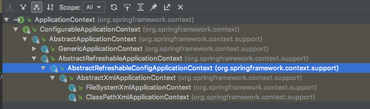
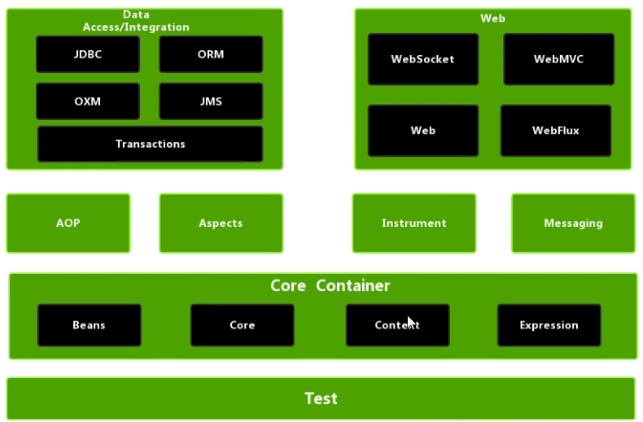

### Spring框架概述
1、轻量级的开源的JavaEE框架
2、可以解决企业应用开发的复杂性
3、两个核心部分：IOC、AOP
    （1）IOC：控制反转，把创建对象过程交给Spring进行管理
    （2）AOP：面向切面，不改源代码进行功能增强

Spring的特点：
（1）方便解耦，简化开发
（2）AOP的支持
（3）方便程序的测试
（4）方便集成各种优秀框架
（5）方便进行事务管理
（6）降低API使用规范

Spring官网。spring.io
springjar包的下载地址：https://repo.spring.io/release/org/springframework/spring/

### Spring的使用
（1）导入Spring的jar包
四个包：Beans、core、context、expression

### IOC
控制反转，对象的创建与对象之间的调用过程，由Spring进行管理
使用IOC，就是为了对象之间解耦

（1）IOC底层原理
1、1 XML解析
1、2 工厂模式
1、3 反射

 
（2）IOC（BeanFactory接口）
Spring提供IOC容器有两种实现：
BeanFactory
ApplicationContext：BeanFactory的子接口，提供更强大的功能
ApplicationContext的实现类：

FileSystemXmlApplicationContext：文件系统下的路径
ClassPathXmlApplicationContext：项目的运行classpath路径

（3）IOC操作bean管理（基于XML方式）
（4）IOC操作bean管理（基于注解方式）

### AOP
1、什么是AOP？
面向切面编程
底层：动态代理

### JdbcTemplate
