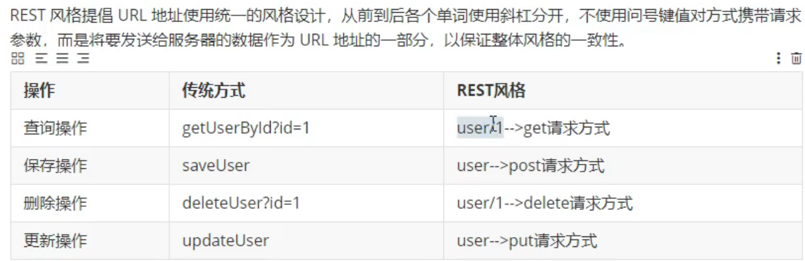
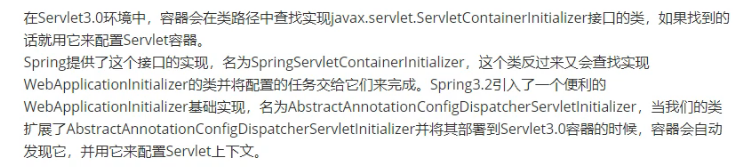
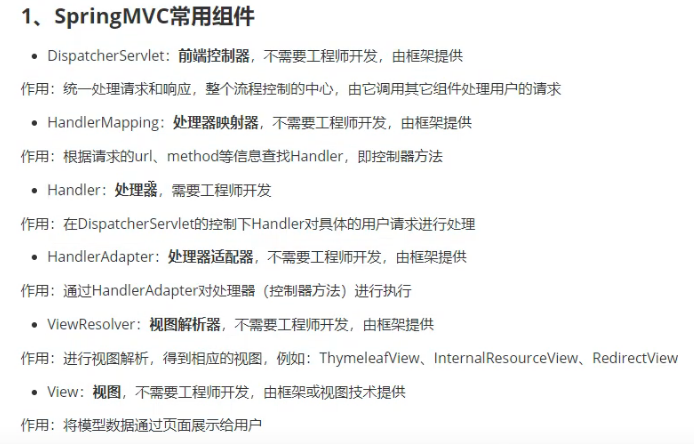

tomcat中启动成功后，默认访问的是index.jsp(在web.xml中配置)
可以在每个项目中的web.xml中配置<welcome-file-list>

request.getContextPath()

### SpringMVC的特点
（1）Spring家族的产品，与Spring无缝连接
（2）基于原生的Servlet（本质就是Servlet），通过了功能强大的前端控制器DispatcherServlet，对请求和响应统一处理

### 创建一个maven项目
引入spring-webmvc依赖包

### SpringMVC中有多个方法对应同一个请求的情况
会报错，建议在类上加@RequestMapping路径进行区分

### @RequestMapping注解
（1）value属性，必填，对应请求路径，是个字符串数组，可以写多个路径，报404
（2）method属性。对应请求方式GET、POST，枚举数组，报405的错
（3）params属性：字符串数组，必须全部满足要求。如果不满足则是报400
（4）headers属性：比如host=localhost:8080，报404

### @RequestMapping的派生注解
@GetMapping
@PostMapping

### SpringMVC支持ant风格的路径
？：表示任意的单个字符
*：表示任意的0或多个字符
**：表示任意的一层或多层目录，在使用**的时候，只能使用/**/XXXX的方式

### SpringMVC支持路径中的占位符
原始方式 /deleteUser?userid=1
rest方式：/deleteUser/1
通过PathVariable注解，解析占位符

### SpringMVC获取请求参数
（1）通过Servlet的API获取：HttpServletRequest request
（2）通过SpringMVC的获取参数：
    2.1、@RequestParam：作用：
        value与name属性将客户端传过来的参数名与控制器方法中的形参名称进行匹配。
        required：设置参数是否是必须的
        defaultValue：设置默认值
    2.2、@RequestHeader：
        value与name属性将将请求头信息与控制器方法的形参创建映射关系
            required：设置参数是否是必须的
            defaultValue：设置默认值
    2.3、@CookieValue：同cookie的数据与形参创建映射关系
        同有三个属性：
（3）通过POJO获取参数

请求中的乱码问题：
（1）请求中的乱码问题
GET的请求的乱码是TOMCAT造成的。通过修改server.xml中的属性URLEncoding="UTF-8"。可以解决GET请求乱码
POST乱码问题：使用过滤器来解决乱码问题，SpringMVC提供了编码过滤器：
org.springframework.web.filter.CharacterEncodingFilter
（2）响应中的乱码问题：org.springframework.web.filter.CharacterEncodingFilter

### 域对象共享数据
三种域对象：
request：一次请求
session：一次会话，浏览器开启到浏览器关闭
钝化：当我们服务器关闭，浏览器没关闭，存储在session的数据，存储到磁盘上
活化：浏览器还没关闭，服务器重启了，这时候就会读取磁盘的session的数据
servletContext：整个应用，跟服务器关闭有关系

（1）request域对象：5种方式
用于列表功能、修改回显、显示错误信息
第一种：request.setAttribute
// 以下是SpringMVC提供的方式
第二种：ModelAndView
第三种：Model
第四种：Map<String, Object> map
第五种：ModelMap
总结：Model、Map、ModelMap运行时类用的同一个类：BindingAwareModelMap
Model、Map、ModelMap最后封装的都是一个ModelAndView
看类的实现结构：ctrl + H

（2）session域对象
推荐使用HttpSession方式
用于保存用户的登陆状态，默认为30分钟过期。

（3）application域对象
推荐使用HttpSession进行获取ServletContext方式

选择域对象：能实现功能的选择范围最小的

ServletContextLister加载时间最早
监听ServletContext的创建与销毁。所以其中的方法只会分别执行一次

### SpringMVC中的视图
springmvc中的视图是View接口   
默认情况下：有转发视图和重定向视图

（1）转发视图：InternalResourceView
（2）重定向视图：RedirectView

当工程引入了jstl包，转发视图回自动转换为JstlView
若使用的Thymeleaf，则使用的是ThymeleafView
看源码的重要方法：DispatcherServlet中的processDispatchResult  

SpringMVC怎么访问jsp的视图？
在SpringMVC.xml中设置InternalResourceViewResolver的视图解析器。配置页面的前后缀

### RESTFUL
Representational State Transfer：表述层资源状态转移
（1）资源：html/xml/json/纯文本/图片/视频/音频

RestFul的实现：
http协议里面，有四个表示操作方式的动词：GET、POST、PUT、DELETE
为什么要使用RestFul？
可以将请求进行统一的格式定义，保证整体的风格一致

StringUtils
HttpServlet干了什么？
在service里面，根据请求方式调用不同的请求方法（如果是get，则调用doGet方法。如果是post，则调用doPost方法）

### HttpMessageConverter
总结：如果参数时放在请求体中，application/json传入后台的话，那么后台要用@RequestBody才能接收到；
                如果不是放在请求体中的话，那么后台接收前台传过来的参数时，要用@RequestParam来接收，或
                则形参前 什么也不写也能接收。
报文信息转换器，将请求报文转换为java对象。或将java对象转换为响应报文
HttpMessageConverter提供了两个注解和两个类型：
@RequestBody：将请求报文转换为java对象
将HTTP的输入流装配到目标类，会根据json字符串中的key来匹配对应实体类的属性（通过调用setter方法）。
@JsonAlias与@JsonProperty可以设置别名。

@ResponseBody：将java对象转换为响应体
响应浏览器数据：两种
（1） 
（2）SpringMVC的方式

1、导入jackson依赖
2、使用@RequestBody

RequestEntity：请求实体，可以接收整个请求报文
ResponseEntity：用于控制器方法的返回值类型
用途：文件下载

### JSON
JSON有两种格式：
json对象与json数组
实体、Map转json：json对象
List转json：json数组

### XML
解析的方式：dom4j

### SpringMVC处理AJAX

servletContext.getRealPath：获取服务器的部署路径(服务器的真实路径)

### SpringMVC中的拦截器
过滤器作用在浏览器与DispatherServlet之间
拦截器的概念：
（1）SpringMVC中的拦截器用于拦截控制器方法的执行
（2）必须在SpringMVC的配置文件中配置
实现自己的拦截器步骤：
（1）实现HandlerInterceptor接口，重写里面的三个方法
（2）在SpringMVC中进行配置拦截器
    <mvc:interceptors>
        <bean class="com.banmao.mvc.interceptors.FirstInterceptor"></bean>
    </mvc:interceptors>
（3）拦截与放行 preHandle中返回true表示放行，返回false表示拦截
多个拦截器的执行顺序
通过在SpringMVC中配置的顺序来执行。
如果某个拦截器返回false，则会立即执行afterCompletion
boolean applyPreHandle(HttpServletRequest request, HttpServletResponse response) throws Exception {
    for(int i = 0; i < this.interceptorList.size(); this.interceptorIndex = i++) {
        HandlerInterceptor interceptor = (HandlerInterceptor)this.interceptorList.get(i);
        if (!interceptor.preHandle(request, response, this.handler)) {
            this.triggerAfterCompletion(request, response, (Exception)null);
            return false;
        }
    }

    return true;
}

拦截器三个方法：
preHandle：在控制器方法执行之前执行
postHandle：在控制器方法执行之后执行
afterCompletion：在视图渲染完毕之后执行

ctrl + O：重写方法的快捷键

### SpringMVC的异常控制器
作用：当控制器方法发生异常时，进行处理异常，返回一个新的ModelAndView
顶级接口：HandlerExceptionResolver
HandlerExceptionResolver接口的实现类有：
DefaultHandlerExceptionResolver和SimpleMappingExceptionResolver
1、基于配置的异常处理
<property name="exceptionMappings">
        <props>
            <prop key="java.lang.ArithmeticException">error</prop>
        </props>
    </property>
    <!--将异常信息共享在请求域中的键-->
    <property name="exceptionAttribute" value="ex"></property>
</bean>

2、基于注解的异常处理
@ControllerAdvice

### 注解配置SpringMVC
使用配置类和注解代替web.xml与SpringMVC配置文件的功能

SpringServletContainerInitializer实现了Servlet3.0的ServletContainerInitializer
SpringServletContainerInitializer类会去找WebApplicationInitializer的实现类
AbstractAnnotationConfigDispatcherServletInitializer这个类实现了WebApplicationInitializer接口

当我们的类去扩展了AbstractAnnotationConfigDispatcherServletInitializer的功能会部署到Servlet3.0容器时，
容器会自动发现它，并用它来配置Servlet上下文

ITemplateResolver templateResolver是Spring容器帮我们自动装配
@Bean
public SpringTemplateEngine templateEngine(ITemplateResolver templateResolver) {
    ...
}

### SpringMVC的执行流程

控制器也叫处理器（叫Controller或Handler都行）
init过程：
DispatherServlet继承于FrameworkServlet:
作用：实现了onRefresh(ApplicationContext context)

FrameworkServlet继承HttpServletBean：
作用：重写了initServletBean()，进行了
initWebApplicationContext(),创建了SpringMVC的容器。并进行onRefresh()进行刷新

HttpServletBean继承HttpServlet
重写了GenericServlet的init()方法
调用了本类的initServletBean()

HttpServlet继承于GenericServlet

GenericServlet：
重写了init(ServletConfig config)方法
调用了本类的init()方法

service过程：
HttpServlet重写了GenericServlet的service(ServletRequest var1, ServletResponse var2)方法
并定义了service(HttpServletRequest req, HttpServletResponse resp)

FrameworkServlet重写了HttpServlet的service(HttpServletRequest req, HttpServletResponse resp)方法
关键方法：this.doService(request, response);

DispatherServlet重写了doService(request, response)方法

doService调用了doDispatch(HttpServletRequest request, HttpServletResponse response)方法

doDispatch中真正的是ha.handle(...)进行执行控制器方法
ha.handle(...)：参数赋值工作

总结：
SpringMVC的处理流程