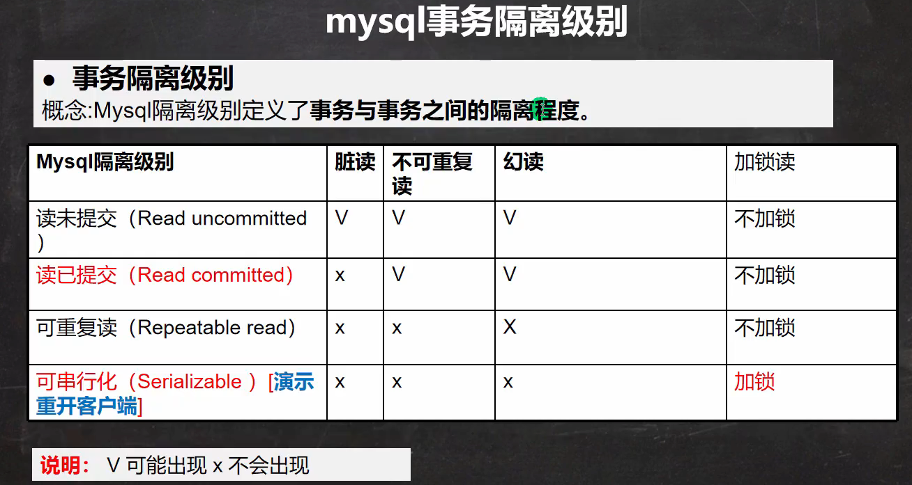
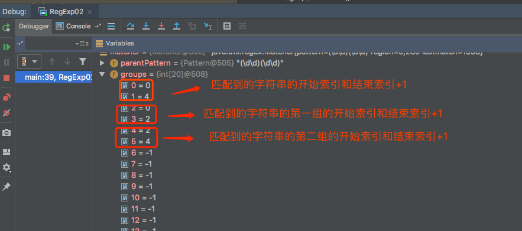

1、网络的一些基本概念
（1）网络通信：
将数据通过网络从一台设备传输到另一台设备
（2）IP地址：用于唯一标识网络中到每台计算机
ip地址的组成：网络地址 + 主机地址
ipV6：用16个字节表示
127.0.0.1表示本机地址
（3）域名
作用：方便记忆，比如百度的域名：www.baidu.com
（4）端口号
用于标识计算机上某个特定的网络端口
表示形式：0-65535。
0-1024已经被占用
（5）网络通讯协议
语言本身就是一种协议
在网络编程中数据的组织形式就是协议。
TCP/IP协议：传输控制协议/因特网互联协议

（6）TCP与UDP
TCP特点：
1、使用TCP前，需建立TCP连接
2、传输前，进行"三次握手"方式，是可靠的
3、在连接中可进行大数据量的传输
4、传输结束，需释放已建立的连接，效率低
5、TCP进行通信的两个应用程序，客户端，服务端
UDP特点：
1、不需要建立连接
2、每个数据包的大小限制在64k，不适合大量数据传输
3、不可靠
4、速度快

TCP不为人知的秘密：
当客户端连接上服务端时，实际上客户端也时通过一个端口和服务端通讯的，这个端口是由TCP/IP分配的。是不确定的，随机的。
UDP核心的两个类：
DatagramSocket与DatagramPacket
核心流程：
（1）建立DatagramSocket与DatagramPacket
（2）建立发送端、接收端（没有服务端与客户端概念）
（3）建立数据包（DatagramPacket对象）
（4）调用DatagramSocket的发送、接收方法
（5）关闭DatagramSocket方法

Java反射
Java程序在计算机有三个阶段：
（1）代码阶段/编译阶段
（2）Class类阶段（加载阶段） => 在堆中生成Class对象
（3）Runtime运行阶段

Class类:
（1）Class类也是类，也继承Object类
（2）Class类对象不是new出来的，而是系统创建的
（3）对于某个类的Class对象，在内存中只有一份
（4）每个类的实例都会记得自己是由哪个Class实例所生成
（4）通过Class对象可以完整的得到一个类的完整结构，通过一系列api
（4）Class对象是存放在堆的
（4）类的字节码二进制数据，是放在方法区的（有些地方成为称为类的元数据）

获取Class对象的几种方法：
（1）代码阶段使用：Class.forName()
应用场景：多用于配置文件
（2）类加载阶段：类.class
应用场景：多用于参数传递
（3）运行阶段：对象.getClass()
（4）类加载器得到Class对象：ClassLoader.loadClass()
（5）包装类型可以通过TYPE来获取Class对象

哪些类有Class对象
String、接口、注解、数组（一维、二维数组）、基本数据类型、void、枚举、Class

类加载：
静态加载：在编译时加载相关的类，如果没有则报错。（在编译时就会加载这个类，进行语法校验。不管有没有校验）
动态加载：运行时加载需要的类（反射是动态加载）
类加载时机：
1、当创建对象时（new）//静态
2、当子类被加载时，父类也加载 //静态
3、调用类中的静态成员时 //静态
4、通过反射/动态加载
类的加载过程：
在类加载的准备阶段：
1、public int n1 = 10     => 在类加载阶段不会分配内存
2、public static int n2 = 10    => 在类加载的准备阶段会初始化为0
3、public static final int n3 = 20  => 在类加载的准备阶段会初始化为30，因为是常量
解析阶段：
1、虚拟机将常量池内的符号引用替换为直接引用的过程
符号引用就是记录的是相对的一个引用关系，相当于相对路径，而当分配内存后，则会替换为地址
初始化阶段：
此阶段才真正开始执行类中的java代码
此阶段是执行<clinit>()方法的过程：
<clinit>会依次收集所有静态变量的赋值动作和静态代码块中的语句。并合并
重要：虚拟机会保证一个类的<clinit>方法在多线程环境下被正确的加锁、同步。如果多个线程同时去初始化一个类，那么只会有一个
线程去执行这个方法。其它线程阻塞等待此线程执行完毕。

MySQL数据库：
连接mysql数据库：Mysql -h localhost -P 3306 -u root -p123456

权限分配：
mysql默认安装之后的用户为root。
（1）查看用户的权限
show grants for root@localhost
（2）授予权限
GRANT 权限1,权限2,…权限n(ALL代表所有权限) PRIVILEGES ON 数据库(*代所有库)名称 . 表名称(*代表库的所有表) 
    TO '用户名' @ 用户地址(%代表任何ip都可以连接) IDENTIFIED BY‘密码’WITH GRANT OPTION;

校对规则：
（1）utf8_bin是区分大小写的
于是当进行字符串匹配时，tom与Tom会被认为是两条数据
（2）utf8_generic_ci是不区分大小写的，于是将只会查出来一条数据

// 显示数据库语句：
show databases

//  显示数据库创建指令
show create database db_name
// 删除数据库
DROP database [IF EXISTS] db_name

2、数据库常用函数
2.1、统计函数
sum、count、avg、max、min
2.2、字符串函数
（1）concat('a','b','c')
（2）left(string, length) //从string的左边起取length个字符
（3）right(string, length) //从string的右边起取length个字符
（4）instr(string, substring) // 返回substring在string串中的位置，没有返回0
（5）length(string) // string长度，按字节返回
（6）replace(str， search_str, replace_str) // 从str中查找search_str替换为replace_str
（7）strcmp(str1， str2) // 逐字符比较两字串大小
（8）substring(str， position, [,length]) // 从str的position开始[从1开始计算]，取length个字符
（9）trim(str) // 去除空格
2.3、数学函数
（1）ABS(num) 绝对值
（2）BIN(decimal_num) 十进制转二进制
（3）CEILING(num) 向上取整
（3）FLOOR(num) 向下取整
（3）CONV(num, from_base, to_base) 进制转换  conv(8, 10, 2) => 将十进制的8，转为二进制输出
（3）FORMAT(num, decimal_places) 保留小数位数
（3）HEX(num) 转16进制
（3）MOD(num) 求余
（3）LEAST(num) 求最小值
（3）RAND(seed) 返回随机数,指定seed，此随机数就不会变
2.4、时间日期函数
 select CURRENT_DATE from dual 
 select CURRENT_TIME from dual
 select CURRENT_TIMESTAMP from dual // 2022-12-09 22:46:04
 
2.5、加密函数
 MD5()
 PASSWORD()

2.6、条件控制函数
IF(expr1,expr2,expr3) // 如果expr1为true，则返回expr2，否则返回expr3
IFNULL(expr1,expr2) // 如果expr1不为null，则返回expr1，否则返回expr2
CASE WHEN THEN END（多重分支）

3、查询SELECT
3.1、查询加强
%表示0～n条，_表示单条数据
order by
分页查询
select ... limit start,rows =》表示从start+1开始取，取出rows行
 
多个查询增强语句的顺序：
group by =》 having =》order by =》limit

3.2、多表查询
默认情况下，当两个表查询时（没有连接条件），会形成笛卡尔积，返回的记录数=
第一张表的记录数 * 第二张表的记录数
3.2.1、自连接
含义：自连接是指在同一张表的连接查询
3.2.2、子查询
3.2.2.1、单行子查询

3.2.2.2、多行子查询

3.2.2.3、
子查询中使用all操作符
多行子查询中使用any操作符

3.2.2.4、多列子查询
SELECT * FROM emp 
        WHERE (deptno, job) = (
            SELECT deptno, job
            FROM emp
            WHERE ename = 'SMITH'
        )

4、表数据复制和自我复制、快速创建表、去重
insert into ... select ... => 从一个表的查询结果插入另一个表
insert into [tablename] select * from [tablename]
create table [table1] like [table2]

如果对一张表的数据进行去重？
 使用临时表和distinct

5、合并查询union、unionall
unionall：简单合并，不会去重

6、表外连接
左外连接（左侧表的所有记录都显示）
右外连接（右侧的表的所有记录都显示）

7、mysql约束
5种约束：not null、unique、primary key、foreign key、check
primary key
（1）不能为null
（2）只能有一个主键，但可以有复合主键
（3）实际开发中，往往每个表都会有一个主键
unique
表示该列不可以重复
（1）unique可以有多个null值
（2）一张表可以有多个unique
foreign key
（1）外键指向的表的字段，要求是primary key或unique的
（2）引擎必须是innodb，这样的表才支持外键
（3）外键字段的类型必须与主键字段的类型一致
（4）外键字段的值，必须在主键字段中出现过，或者为null（前提是外键字段允许为null）
（5）一旦建立主外键关系，数据不能随意删除了

8、MySQL自增长
auto_increment
（1）一般是设置主键为自增长
（2）自增长也可以单独使用，但一般是配合unique
（3）自增长一般是整数类型的。小数类型虽然也可以，但是很少这样使用
（4）自增长默认从1开始。你也可以通过如下命令修改alter table 表名 auto_increment = 新的开始值

9、MySQL索引
索引本身也会占用空间（空间换时间）
（1）创建索引
创建索引后，只对创建索引的列有效
create index [索引名称] on [表名](字段名)

索引的原理：
使用索引为什么会慢？全表扫描
使用索引为什么会快？
形成一个索引的数据结构，比如二叉树。
索引的代码：
（1）磁盘占用
（2）对dml（修改、删除、添加）语句的效率有影响。
因为进行dml语句时，会重新维护索引

索引的类型：
（1）主键索引（主键自动为索引）
（1）唯一索引（unique）（unique自动为索引）
（1）普通索引（INDEX）
（1）全文索引（FULLTEXT）【适用于MyISAM】 =》效率比较低，一般不会使用
开发中考虑使用：全文索引Solr和ElasticSearch（ES）

索引相关语句：
查询表是否有索引：
show indexes from [tablename]
添加索引：
（1）create [unique] index index_name on tbl_name(col_name[(length)][ASC][DESC], ...)
（2）alter table table_name add index[index_name](index_col_name,...)
添加主键索引：
ALTER TABEL 表名 ADD PRIMARY KEY(列名,...)
删除索引：
DROP INDEX index_name on tbl_name
ALTER TABLE tal_name drop index index_name
删除主键索引：
alter table tbl_name drop primary key;

哪些列上适合创建索引？
1、较频繁的作为查询条件字段应该创建索引
2、唯一性太差的字段不适合单独创建索引
3、更新非常频繁的字段不适合用索引
4、不会出现在where上的字段不该创建索引

10、事务
需求：将多个DML（update、delete、insert）语句当作一个整体， 要么全部成功，要么全部失败/
mysql数据库控制事务有几个重要的操作：
（1）start transaction  -- 开始一个事务
（1）savepoint  -- 设置保存点
（1）rollback to [保存点名]-- 回退事务到某个保存点
（1）rollback -- 回退全部事务
（1）commit  -- 提交事务

事务细节：
（1）如果没有开启事务，默认的dml都是自动提交事务的，不能回滚
（2）mysql事务机制需要innodb支持，myisam不行
（3）或者使用set autocommit false来开启事务

事务的隔离级别：
理解：多个连接开启各自事务操作数据库中数据时，数据库系统要负责隔离操作，以保证各个连接在获取数据时的准确性。
如果不考虑隔离性，可能会引发以下问题：
（1）脏读
（2）不可重复读
（3）幻读

查询数据库的隔离级别是什么？
SELECT @@tx_isolation(innodb默认为REPEATABLE-READ(可重复读))
设置数据库的隔离级别：SET SESSION TRANSATION ISOLATION LEVEL READ UNCOMMITTED

事务的ACID特性：
原子性：
一致性：
隔离性：
持久性：

Mysql表的类型与存储引擎：
SHOW ENGINES
INNODB：支持事务、行级锁定与外键

视图：
（1）视图是虚拟表，数据来自基表，可以有多个基表
（2）通过视图可以修改基表的数据
（3）基表的数据修改，也会反应在视图数据上
视图的创建：
create view [视图名] as select 基表

MySQL用户的管理：
create user 'caominglong'@'localhost' identified by '123456'
解读：
'caominglong'为用户名
'localhost'为登陆的ip
'123456' 密码，但存到数据库中，存的是加密后的密码
（2）删除用户
DROP USER 'caominglong'@'localhost'
（3）用户修改密码
修改自己的密码
set password = password('abcdef')
修改其他人的密码（需要有权限）
set password for 'caominglong'@'localhost' = password('abcdef')
给用户授权
grant（revoke（撤销权限）） 权限列表 on 库.对象名 to '用户名'@'登陆位置' [identifed for '密码']

[identifed for '密码']的含义：如果用户存在，相当于修改密码
[identifed for '密码']：如果用户不存在，相当于创建用户

用户管理的细节：
如果创建用户时，不指定localhost。设置为'%'，则表示任何ip都有连接权限

11、JDBC
为什么需要JDBC？
1、如果不同的数据库，我们的方法不统一，不利于程序管理
2、改进：规定一套接口规范，让不同的数据库厂商实现
11.1、编写步骤：
（1）注册驱动 - 加载Driver类
（2）获取连接 - 获取Connection类
（3）执行增删改查 - 发送sql命令
（4）释放资源 - 关闭连接

11.2、获取数据库5种方式
（1）静态加载：Driver driver = new com.mysql.jdbc.Driver();
（2）动态加载：Class class = Class

11.3、Statement
（1）Statement(sql注入)
（2）PreparedStatement[预处理]
（3）CallableStatement[存储过程]
开发中主要用的是PreparedStatement

12、JDBC怎么使用事务
（1）默认情况下，是自动提交事务
怎么在jdbc中使用事务？
connect.setAutoCommit(false) // 设置成false，不自动提交
在所有sql语句都执行成功后，再执行connect.commit()
在某个操作执行失败或异常后，使用connect.rollback() 进行回滚

13、批处理
当需要成批插入或者更新记录时，可以采用java的批量更新机制，
这一机制可以允许多条语句一次性的提交给数据库批量处理。
JDBC的批量处理包括下面方法：
addBatch()：添加需要批量处理的SQL语句或参数
executeBatch()：执行批量处理语句
clearBatch()：清空批处理的语句
JDBC连接mysql时，如果需要批处理功能，请在url中加参数，rewriteBatchedStatements=true
批处理一般结合PreparedStatement一起使用，即减少编译次数，又减少执行次数，效率大大提高。

14、
DAO层：data access object => 数据访问对象
Service层：业务层，组织sql，调用相应的XxxDao完成综合的需求
View层：界面层，调用Service层的类，得到结果，显示数据

15、正则表达式
细节：java正则匹配是贪婪匹配，是尽可能匹配多的
细节：[.]，[]里面的.代表的.本身
细节：java中的正则表达式是默认区分大小写的。可以添加(?i)，表示不区分大小写
Pattern.CASE_INSENSITIVE：表示不区分大小写
或者Pattern pattern = Pattern.compile(regStr, Pattern.CASE_INSENSITIVE);
String regStr = "(\\d\\d)(\\d\\d)"

元字符：
（1）字符匹配符
[]：可接收的字符列表
[^]：不接收的字符列表
-：连字符
.：\n之外的任意一个字符

（2）选择匹配符：代表是可选择的匹配，即可以匹配A，也可以匹配B
|：匹配|之前或之后的表达式

（3）限定符（*、+、?、{n}、{n,?}, {n,m}]）：用于指定其前面的字符和组合项连续出现多少次

（4）定位符
说明：规定要匹配的字符串出现的位置，比如在字符串的开始还是在结束的位置
^：指定起始位置
$：指定结束的位置

（5）分组
（pattern）：非命名捕获
（？<name>pattern）：命名捕获
特别分组：

三个常用类：
Pattern：
Matcher：

分组、捕获、反向引用的关系：

