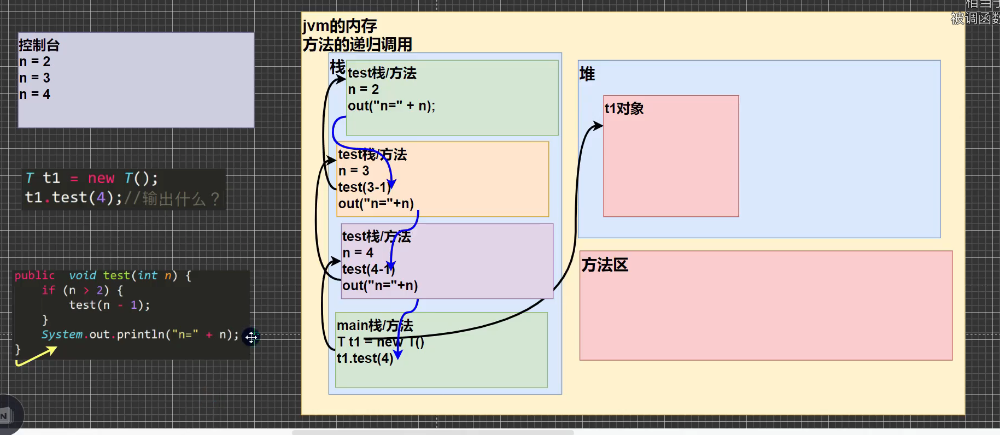
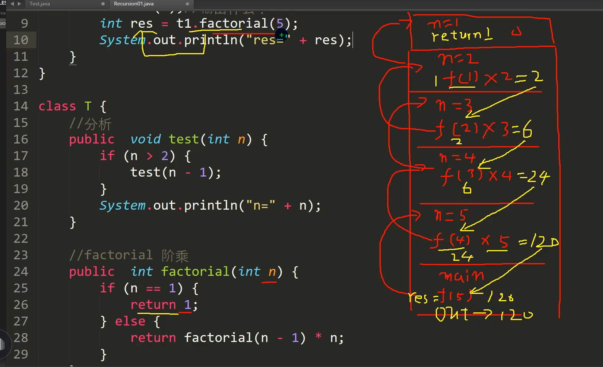
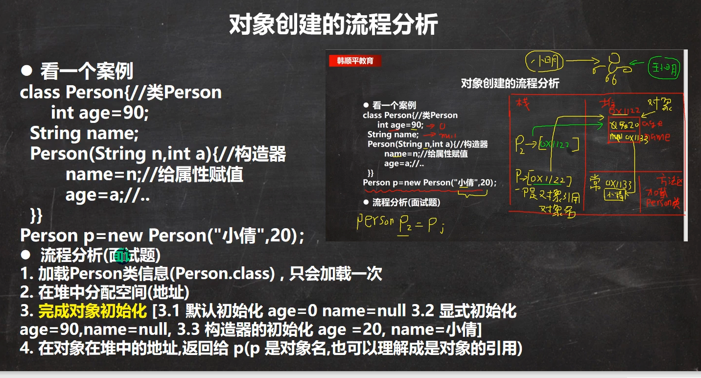
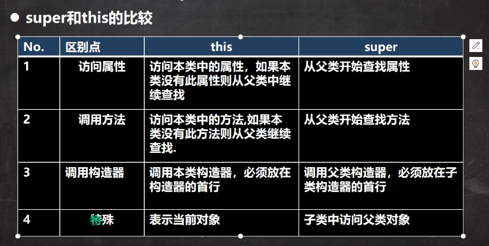
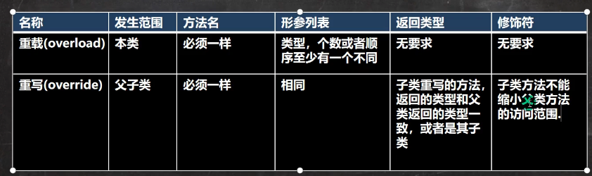
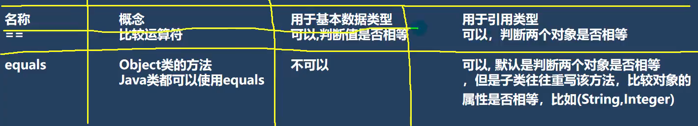
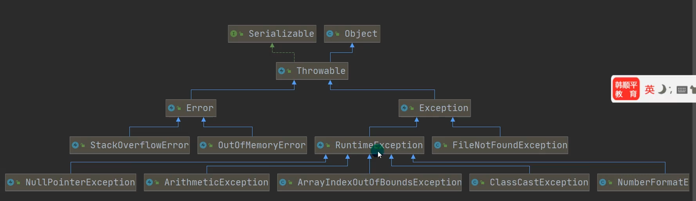
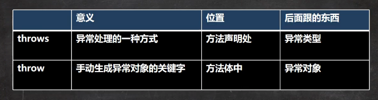

### java基础细节

1、java的各整数类型有固定的范围和字段长度，不受具体操作系统的影响。以保证Java程序的可移植性。
2、浮点数在计算机中存放的形式：符号位+指数位+尾数位
3、浮点数尾数部分可能丢失，造成精度损失（小数都是近似值）
4、java的浮点型默认为double类型。推荐使用double类型
5、int num1 = 2.7
Int num2 = 8.1 / 3
num2的值是一个无限接近于2.7的值
所以：当我们用运算结果是小数时进行判断，要小心。
推荐：将两个数的差值的绝对值，小于某个精度范围的算相等。比如：Math.abs(num1 - num2) < 0.0001算相等

6、javaapi中文在线文档：
https://www.matools.com

7、字符类型可以直接存放一个数字。因为ASCII码

8、字符类型只能用单引号来引用

9、java中，char的本质是一个整数，在输出时，是unicode码对应的字符

10、字符类型char可以参与运算的，比如’a’ + 10 = 107

11、字符型存储到计算机中，需要将字符对应的码值（整数）找出来，比如’a’
存储：‘a’ ==> 码值97 ==> 二进制(1100001) ==> 存储
读取：二进制(1100001) ==> 码值97 ==> ‘a’ ==> 显示

12、字符和码值的对应关系是通过字符编码表来决定的（是规定好的）

13、ASCII，一共128个字符，一个字节表示
Unicode，固定大小的编码，使用两个字节来表示字符，字母和汉字统一都是占用两个字节，浪费空间
Utf-8（大小可变的编码，字母使用一个字节，汉字使用3个字节）
Gbk编码，可以表示汉字，字母用一个字节，汉字使用两个字节
Gb2312，表示的汉字比较少
Big5码，可以表示繁体字

14、java无法用0，1来表示boolean类型

15、编译后，每一个类对应一个class文件。

16、多行注释不允许嵌套
17、可以用javadoc指令生成java文档。
18、cmd下输入的命令为Dos命令
19、相对路径：从当前目录开始定位，形成的一个路径
绝对路径：从顶级目录开始定位，形成的路径

20、当有多种数据混合运算的时候，系统自动将所有数据转成容量最大的那种数据类型，然后再进行计算。

21、数据类型按精度大小排序为：
Chat -› int -›long -›float-›double
Byte short int long float double
byte与short不能与char发生自动类型转换

22、byte、short、char之间是可以运算的，在计算时首先转换为int类型

23、boolean不参与自动类型转换

24、强制类型转换会造成精度损失，所以程序员使用时要十分注意。

25、怎么将字符串转为字符？
S5.charAt(0) => 取出字符串中的第一个字符

26、取模运算，的本质，看一个公式。a % b = a - a / b * b
取模结果的正负号取决于除数。

27、作为表达式使用，前++是先自增后赋值
后++是先赋值后自增。比如 int k = j++与 int k = ++j的区别

28、 int a = 1;a = a++;的执行过程。（1）a将数据保存到临时变量temp中，（2）a = a + 1。（3）临时变量temp赋值给a，所以最终结果a的结果为1
int a = 1;a = ++a;（1）a = a + 1，（2）a将数据保存到临时变量temp中。（3）临时变量temp赋值给a，所以最终结果a的结果为2

29、短路与&&  逻辑与&的区别，当第一个为false的时候，短路与将不会执行剩余条件。逻辑与会执行。短路或与逻辑或亦然。

30、标识符的概念：java对各种变量、方法和类等命名时使用的字符序列为标识符。简单理解：就是自己能起名字的地方叫标识符。
标识符的规则：由26个英文字母大小写、0-9数字、_或$符号组成。不可以用数字开头，不可以使用关键字和保留字，不能包含空格。Java中标识符严格区分大小写，长度无限制。
标识符的规范：
包名：所有字母都小写
类名、接口名：驼峰原则。首字母大写
变量名、方法名：驼峰原则
常量名：所有字母大写。

31、Scanner：扫描器对象。控制用户输入输出

32、二进制可以用0b或0B开头。比如0b1010。8进制可以用0开头，比如01010。16进制用0x开头，比如0x1010

33、二进制转八进制，将每三位一组转成对应的八进制数就行了。二进制转八进制，将每四位一组转成对应的十六进制即可。八进制转二进制，将八进制的每一位转成对应一个3位的二进制即可。十六进制转二进制，将十六进制每一位，转成对应的4位二进制即可。

34、有符号数：
    1、最高位为符号位，0代表正数，1代表负数。
    2、正数的原码、反码、补码都一样。
    3、负数的反码等于原码的符号位不变，其它位取反
    4、负数的补码=反码+1，负数的反码=补码-1
    5、0的反码补码都是0
    6、java中的数都是有符号的
    7、在计算机中计算是，都是以补码的方式运算的。所以运算时，要先得到补码。
    8、当我们看运算结果时，要看它的原码

35、算术右移：>> 低位溢出，符号位不变。并用符号位补缺失的高位。
算术左移：<< 符号位不变，低位补0
 无符号右移：>>> 低位溢出，高位补0

36、有小数参与运算时，得到的是近似值

37、嵌套if不要超过3层

38、switch：
1、switch(表达式)：表达式对应一个值
2、case 常量1：当表达式的值等于常量1，就执行语句块1
3、break：退出switch
4、如果没有与case常量1匹配， 就继续匹配case常量2
5、如果都没有匹配，执行default

39、在java中，只要有值返回，都是一个表达式。

40、switch细节：
1、switch表达式类型与case中的常量类型需要匹配一致，否则报错。
2、switch表达式中的类型必须是以下类型之一：[byte、short、int、char、enum、String]
3、case中的值必须是常量、或者是常量表达式，不能是变量。
4、default是可选的，当没有匹配的case时，执行default
5、如果没有写break语句，程序将顺序执行到switch结尾。“穿透”

41、如果判断的类型不多，且满足[byte、short、int、char、enum、String]，建议用switch，如果判断的类型为区间，建议用if。

42、程序控制结构有三种：顺序、分支、循环

43、编程思想：
化繁为简：将复杂的需求，拆解为简单的需求
先死后活：先考虑固定的值，再考虑灵活的变量

44、for、while、do-while都有四要素。
四要素为：循环变量初始化、循环条件、循环体、循环变量迭代

45、多重循环一般建议两层，不要超过3层

46、数组可以存放多个“同一类型”的数据，数组也是一个数据类型，是引用类型。

47、数组的初始化有两种：动态初始化与静态初始化
动态初始化：int[] a = new int[9]
静态初始化：int[] a = {1,2,3,4,5,6,7,8,9}

48、基本数据类型是值拷贝，引用数据类型是地址拷贝

49、数组拷贝方法1：新的数组需要重新开辟数据空间（比如int[] newArr = new int[10]），然后将值一个个的复制到新数组中。

50、数组反转：
方式一：找规律反转，将第一个元素与最后一个元素位置调换。将第二个元素与倒数第二个元素位置调换。以此类推。
方式二：逆序遍历并赋值

51、数组扩容需要先申请空间，然后将旧数组赋值到新数组中。很麻烦。相比链表扩容很容易。但是链表访问元素比较麻烦。

52、二维数组：原来一维数组里的每个元素是一维数组，构成二维数组。

53、二维数组细节：
    1、用[][]标明，用arr.length得到二维数组的长度
    2、如果要得到每个一维数组的值，需要再次遍历
    3、如果需要访问第i个一维数组的第j个值。需要使用arr[i][j]的方式
    4、int[][] aa = new int[2][3]的含义是：此数组具有2个一维数组，每个一维数组有3个元素。
    5、二维数组里面的一维数组，其实存储的也是地址，符合引用类型的规则。
    
54、二维数组使用方式
    1、int[][] aa = {{},{}}
    2、int[][] aa = new int[2][3]
    3、int[][] aa; // 先声明
     aa = new int[2][3] // 再申请内存空间
    4、int[][] aa = new int[2][] 
    第二个一维数组可以为空，代表的是一维数组并没有申请内存空间。所以当使用时，需要申请内存空间才能使用。
    
55、类就是一种自定义类型（数据类型）。
类是抽象的，对象是具体的，类是对象的一个模版

56、对象在内存中存在的形式：
1、对象在堆里面开辟空间。根据对象属性不同，存的类型不同。如果是基本数据类型，就存堆里。如果是引用数据类型（比如String）
String类型会存在方法区的常量池里。其它引用类型，当前对象存的是地址。
2、在执行new动作的时候，会加载类的信息到方法区。属性信息与行为（方法）信息

57、属性的细节：
属性的定义与变量基本一致。访问修饰符 + 属性类型 + 类型名。相比变量多了访问修饰符这种东西。
属性的定义可以是任意类型。
属性如果不赋值。有默认值，规则和数组一致。

58、创建对象的两种形式：
1、先声明。再创建。
Cat cat;
cat = new Cat();
2、直接创建
Cat cat = new Cat();

59、类和对象的内存分配机制
java内存的结构分析：
栈：一般存放基本数据类型（局部变量）
堆：存放对象（Cat cat。数组等）
方法区：常量池（常量、比如字符串），类加载信息

60、java创建对象的流程简单分析
1、先加载类的信息（属性和方法信息）。只会加载一次。当再次创建对象的时候，不会重复加载
2、在堆中分配空间。进行默认初始化
3、把堆中的地址赋值给对象引用（对象名）
4、进行指定初始化

61、方法的调用机制分析
1、在栈里面创建一个空间（main栈）
2、当执行到p1.getSum()方法时，在栈里面会再开一个空间（getSum栈）。
3、在（getSum栈）执行完方法，然后进行返回执行的结果
4、返回到（main栈），然后继续往下执行。原先的（getSum栈）会被销毁

62、方法的调用机制分析要点：
1、当程序执行到方法时，就开辟一个独立的空间（栈空间）
2、当方法执行完毕，或者执行到return时，就会返回
3、返回到调用方法的地方
4、返回后继续执行方法后面的代码
5、当主（main栈）方法执行完毕后，整个程序退出

63、成员方法的好处：
1、提高代码的复用性
2、可以将实现的细节封装起来。然后供其它用户调用即可。

64、成员方法的定义：
访问控制符 + 返回的数据类型 + 方法名 + （形参列表）{// 方法体 // return语句（可省）}

65、成员方法的注意事项与使用细节
1、访问修饰符如果不写，就是默认的访问修饰符。【有四种访问修饰符：public protected defalut、private】
2、返回数据类型
（1）一个方法最多有一个返回值
（2）返回类型可以是任意类型
（3）如果方法要求有返回数据类型，则方法体最后的执行语句必须为return + 值。
并要求返回值类型和return值的类型一致或兼容
（4）如果方法返回类型为void，方法中可以没有return，或者可以加return（不需要值）
3、方法名遵循驼峰命名，最好见名知义
4、形参列表
（1）一个方法可以有0或者多个参数
（2）参数类型可以为任意类型
（3）调用带参数的方法时，一定要传入与参数列表相同类型与兼容的参数。
（4）方法调用时传入的参数为实参。实参与形参的类型、个数、顺序必须一致。
5、方法体
方法之中不能嵌套方法。
6、方法调用细节：
（1）同一个类的方法可以直接调用
（2）跨类的方法A类调用B类的方法，需要通过对象名调用。
（3）跨类的方法调用与方法的访问修饰符有关系。

66、方法的传参机制
基本数据类型，传递的是值拷贝，形参的任何改变不影响实参
引用类型，传递是地址，可以通过形参改变实参

67、方法的递归调用
说明：方法自己调用自己
作用：用于解决复杂的问题
递归能解决什么问题：
各种数学问题：8皇后问题，汉诺塔、阶乘问题、迷宫问题、球和篮子的问题
各种算法中也会遇到递归：比如快排、归并排序、二分查找、分治算法等
将用栈解决的问题，递归代码比较简洁

68、递归调用的机制

70、使用递归的重要原则
（1）执行一个方法时，就创建一个新的受保护的独立空间（栈空间）
（2）方法的局部变量是独立的。不会相互影响。比如n变量
（3）如果方法中使用的是引用类型变量（比如数组、对象），就会共享该引用类型的数据
（4）递归必须向退出递归的条件逼近，不然就会无限递归。出现（StackOverflowError）
（5）当一个方法执行完毕或者遇到return，就会返回，遵守谁调用就将结果返回给谁，同时当方法执行完毕或者返回时，该方法也就执行完毕。

71、方法重载
注意事项和使用细节：
方法名：必须相同
形参列表：必须不同（类型不同或顺序不同或个数不同）。参数名无要求
返回类型：无要求（当两个函数返回类型不同，但是方法名、形参列表相同，这时这个方法属于重复定义，会报错）

72、可变参数的注意事项和使用细节
（1）可变参数的实参可以为0个或任意多个
（2）可变参数的实参可以为数组
（3）可变参数的本质就是数组
（4）可变参数可以与普通类型的参数放在形参列表，但必须保证可变参数放在最后
（5）一个形参列表只能出现一个可变参数

73、作用域
// 1、局部变量一般是指在成员方法中定义的变量
Java中作用域的分类
全局变量：也就是属性，作用域为整个类体。
局部变量：作用域为定义它的代码块中
全局变量（属性）可以不赋值，直接使用，因为有默认值，局部变量必须赋值后才能使用。因为没有默认值。
（1）属性和局部变量可以重名，使用时遵循就近原则。
（2）在同一个作用域中，局部变量不能重名
（3）属性生命周期较长，伴随着对象的创建而创建，伴随着对象的死亡而死亡，
局部变量的生命周期较短，伴随着它的代码块的执行而创建，伴随着代码块的结束而死亡。即在一次方法调用中。
（4）作用域范围不同：
全局变量/属性：可以被本类使用，或其它类使用（通过对象调用）
局部变量：只能在本类中对应的方法中使用
（5）修饰符不同
全局变量/属性可以加修饰符
局部变量不能加修饰符

74、构造器
特点：
（1）方法名和类名相同
（2）没有返回值
（3）在创建对象时，系统会自动调用该对象的构造器完成对象的初始化
使用细节：
（1）一个类可以定义多个不同的构造器，即构造器重载
（2）构造器名和类名要相同
（3）构造器没有返回值
（4）构造器是完成对象的初始化，而不是创建对象
（5）在创建对象时，系统自动的调用该类的构造器
（6）如果程序员没有定义构造器，系统会默认分配一个无参构造器。（也叫作默认构造方法）
（7）一旦你自己定义了构造器，默认的无参构造器就被覆盖了。就不能再使用无参的构造器了，除非你显示的再定义下

75、对象创建的流程分析

76、this关键字
理解：可以理解成，每个对象创建完毕后（分配空间后），this指向它自己（this：0x1122）.
可以使用this.hashcode()来验证。简单的说，哪个对象调用，this就代表哪个对象
使用细节：
（1）this关键字可以用来访问本类的属性、方法、构造器
（2）this用于区分当前类的属性和局部变量
（3）访问成员方法的语法：this.方法名（参数列表）
（4）访问构造器语法：this(参数列表)。注意只能在构造器中使用。
只能在构造器中访问另一个构造器。而且必须放置在第一条语句。
（5）this不能在类定义的外部使用，只能在类定义的方法中使用

77、IDEA中的模版或自定义模版
（1）main模版
（2）fori模版
（3）Live Templates可以自定义模版（可以自定义一些排序查找的模版）

78、java中包
三大作用：
（1）区分相同名字的类
（2）当类很多时，可以很好的管理类
（3）控制访问范围
本质：就是创建不同的文件夹来保存类文件。
包的命名：只能包含数字、字母、下划线、小圆点，但不能以数字开头，不能是关键字和保留字
com.公司名.项目名.业务模块名
package作用是声明当前类所在的包，需要放在类的最上面（第一行），一个类中最多只有一个package
import放在package下面，在类定义之前，可以有多条且没有顺序要求

79、访问修饰符
public：公开权限
protected：受保护的，对子类和同一个包中的类公开
默认级别：对同一个包中的类公开
private：只有本类才可以使用，不对外公开
使用事项：
（1）修饰符可以用来修饰类中的属性、成员方法和类
（2）只有默认级别和public才能修饰类（除了内部类）
（3）成员方法的访问权限与属性完全一样

80、封装（重点）
封装就是把抽象出的数据【属性】和对数据的操作【方法】封装在一起，
数据被保护在内部，程序的其它部分只有通过被授权的操作【方法】才能对数据进行操作。
好处：
（1）隐藏实现的细节
（2）可以对数据进行验证，保证安全合理
实现步骤：
（1）属性私有化
（2）提供公有的set/get方法

81、继承（重点）
继承可以解决代码复用，当多个类存在相同的属性（变量）和方法时，可以从这些类中抽象出父类，
在父类中定义这些相同的属性和方法，子类不需要重新定义。只需要通过extends来继承父类即可。
继承的基本语法：
class 子类 extends 父类{
}
（1）子类会自动拥有父类定义的属性和方法
（2）父类又叫超类或基类
（3）子类又叫派生类
带来的好处：
（1）代码的复用性提高
（2）代码的扩展性和维护性提高了
继承的细节：
（1）子类继承了父类的所有属性和方法，非私有的属性和方法可以在子类直接访问，
私有属性和方法不能在子类直接访问。要通过父类提供的公共方法去访问。
（2）子类必须调用父类的构造器，完成父类的初始化（原因在于子类的构造器中默认有super()代码）
（3）当创建子类对象时，不管使用子类的哪个构造器，默认情况下总会去调用父类的无参构造器，没有
父类没有提供无参构造器，则必须在子类的构造器中用super去指定使用父类的哪个构造器完成对父类的
初始化工作。否则，编译不会通过。
（4）如果希望指定去调用父类的某个构造器，则显示的调用一下：super(参数列表)
（5）super在使用时，必须放在构造器的第一行（参考this），super只能在构造器中使用
（6）super与this不能共存于同一个构造器
（7）java所有类都是Object的子类。Object是所有类的基类
（8）父类构造器的调用不限于直接父类，将一直追溯直到Object类（顶级父类）
（9）子类最多只能继承一个父类（直接继承），java是单继承机制
（10）不能滥用继承，子类和父类之间必须满足is-a的逻辑关系
继承的本质：
子类的对象在new时，比如C继承B，B继承A。A有一个属性name，B有一个属性age，C有一个属性weight，那么当new C()时。
C的内存空间中将初始化三种属性，name、age和weight。如果B中还有一个name属性，在C的内存空间中也不存在冲突。（即继承关系中的同名属性不存在冲突）
查找关系：
（1）首先看子类是否有该属性
（2）如果子类有这个属性，并且可以访问，则返回信息。如果没有权限访问，直接报错，而不会再往上找了。
（3）如果子类没有这个属性，则向上（一级一级）找

82、super关键字：
基本语法
（1）可以访问父类的属性，但不能访问父类的private属性。super.属性名
（2）可以访问父类的方法，但不能访问父类的private方法。super.方法名
（3）可以访问父类的构造器。super(参数列表)；只能放在构造器的第一句，只能出现一句。
带来的便利：
（1）调用父类构造器。（分工明确，父类属性由父类构造器初始化，子类由子类初始化）
（2）当子类中有和父类中的成员（属性和方法）重名时，为了访问父类的成员，则必须使用super。如果没有重名，使用
super、this、直接访问是一样的效果。都会一级一级向上查找属性。
（3）super的访问不限于直接父类，如果爷爷类中也有同名的成员，也可以用super去访问爷爷类的成员，如果多个
基类中都有同名的成员，使用super访问遵循就近原则。A->B->C

83、方法重写
注意事项和使用细节：
（1）子类的方法的参数、名称要与父类的参数、名称完全一样
（2）子类方法的返回类型与父类方法的返回类型一样，或者是父类返回类型的子类（返回的更加具体）
（3）子类方法不能缩小父类方法的访问权限（一代更比一代强）
方法重写和重载的比较：

84、多态
传统的方法带来的问题是什么？如何解决？
问题是：代码的复用性不高，而且不利于代码维护。
解决方案：多态
1、方法的多态
方法的重载与重写就体现多态
方法的重载：使用不同的参数就会调用不同的方法，就体现出多态
重写：根据调用对象的不同，调用的方法就不同
2、对象的多态（核心）
以下四点最好记住
（1）一个对象的编译类型与运行类型可以不一致
（2）编译类型在定义对象时，已经确定，不能改变
（3）运行类型是可以改变的
（4）编译类型看 = 号的左边，运行类型看 = 的右边
注意事项和使用细节：
前提：两个类存在继承关系
多态的向上转型：
（1）本质：父类的引用指向了子类的对象
（2）语法：父类类型 引用名 = new 子类类型()
（3）编译类型看左边，访问类型看右边
可以调用父类中的所有成员（遵循访问权限）
不能调用子类中的特有成员
多态的向下转型：
作用：当父类的引用要调用子类的方法的时候
（1）语法：子类类型 引用名 = （子类类型）父类引用
（2）只能强转父类的引用，不能强转父类的对象
（3）要求父类的引用必须指向的是当前目标类型的对象
（4）当向下转型后，可以调用子类类型中所有的成员
细节：属性没有重写之说，属性的值看编译类型
动态绑定机制：
1、当调用对象方法的时候，该方法会和该对象的内存地址/运行类型绑定
2、当调用对象属性时，没有动态绑定机制，哪里声明，哪里使用

85、Object类：
1、equals()：
equals()与 == 的区别：
"=="：既可以判断基本类型，又可以判断引用类型
如果判断基本类型，就是判断值是否相等
如果判断引用类型的话。判断的是地址是否相等，即是不是一个对象
"equals"：只能判断引用类型。
默认判断的是地址是否相等，子类中往往重写该方法，用于判断内容是否相等。比如Integer、String
String中的equals是判断字符串的值是否相等
2、hashcode()：
6个结论：
（1）提高具有哈希结构的容器的效率
（2）两个引用，如果指向的是同一个对象，则哈希值肯定是一样的
（3）两个引用，如果指向的是不同对象，则哈希值是不一样的
（4）哈希值主要是根据地址号来的，不能完全等价于地址
（5）后面在集合中，hashcode如果需要的话，也会重写
3、toString()：
默认返回：全类名 + @ + 哈希值的十六进制
重写toString()方法，打印对象或拼接对象时，都会自动调用该对象的toString()形式
当直接输出一个对象时，该对象的toString()方法会被默认的调用
4、finalize()：
（1）当对象被回收时，系统自动调用该对象的finalize方法。子类可以重写该方法，做一些释放资源的操作。
（2）什么时候被回收：当某个对象没有任何引用时，则JVM就认为这个对象是一个"垃圾"，就会使用垃圾
回收机制来销毁该对象，在销毁该对象前，会先调用finalize方法
（3）垃圾回收机制的调用，是由系统来决定，也可以通过System.gc()主动触发垃圾回收机制。

86、断点调试：
重要提示：在整个断点调试过程中，看的都是对象的运行状态
快捷键：
F7：跳入方法内
F8：逐行执行代码
shift + F8：跳出方法
F9：执行到下一个断点

87、说出==与equals的区别？

88、什么是多态？多态的具体体现有哪些？
1、多态：方法或对象具有多种形态，是OOP的第三大特征，是建立在封装和继承基础之上。
多态具体体现：
（1）方法的重载
（2）方法的重写
（3）对象多态：对象的编译类型和运行类型可以不一致。
对象的编译类型在定义时，就已经确定，不能改变。对象的运行类型是可以变化的。可以通过getClass()来查看具体类型。
编译类型看 = 的左边，运行类型看 = 的右边。

89、java的动态绑定机制是什么？
当调用对象的方法时，该方法会和对象的内存地址/运行类型绑定。 
所以该方法会从运行类型开始查找。
当调用对象的属性时，没有动态绑定机制，哪里声明哪里使用。

90、类变量（static）
特点：static修饰的类，会被该类的所有对象实例共享
static变量，在类加载的时候就会加载
定义：用static来修饰。类变量是类加载而创建，所以没有创建对象就可以访问
访问权限：与其它普通属性一样，具有相同的访问权限控制。
访问方式：（1）可以通过类名.变量名访问（推荐） （2）可以通过对象.变量名来访问
2、使用细节：
什么时候需要：当需要所有对象共享一块数据的时候
类变量与实例变量区别：类变量是该类所有对象共享的，实例变量是对象独有的。
实例变量不能通过类名.类变量名方式访问
类变量在类加载的时候就初始化了
类变量的生命周期随着类的加载开始，随着类的消亡而销毁。

91、类方法
特点：在普通方法上添加static修饰，其它特点类似于类变量。
使用场景：
1、当方法中不涉及到任何和对象相关的成员时，设计成静态方法，提高开发效率。
2、往往将一些通用的方法，设计成静态方法，方便调用。
注意事项和使用细节：
1、类方法和普通方法都是随着类的加载而加载，将结构信息存储在方法区。
类方法中无this的参数，普通方法中隐藏着this的参数
2、类方法可以通过类名对象，也可以通过对象名调用（需要满足访问权限）
3、普通方法和对象有关，需要通过对象名调用。
4、类方法中不可以使用和对象有关的关键字，比如this和super。普通方法可以。
5、类方法中只能访问静态方法和静态成员
6、普通成员方法，既可以访问普通变量（方法），也可以访问静态变量（方法）

92、静态域
内存布局：
有些说是在方法区，有些说是堆中，跟JDK版本有关系。
JDK7以上版本：静态域存储于定义类型的Class对象中。Class对象如同堆中其它对象一样，存在于GC堆中

93、main方法
细节：
1、java虚拟机需要调用类的main()方法，所以该方法的访问权限必须是public
2、java虚拟机在执行main方法时不必创建对象，所以该方法必须是static
3、该方法接收String类型的数组参数，该数组中保存执行java命令时传递给所运行的类的参数
4、语法为：java 执行的程序（运行的类名）参数1 参数2 参数3 ...
特别提示：main方法可以直接使用静态成员（属性和方法）

94、代码块（初始化块）
1、基本介绍：属于类的成员，它没有方法名，没有返回，没有参数，只有执行体，而且不用通过
对象或类显示调用，而是加载类时，或创建对象时隐式调用。
2、基本语法：
[修饰符] {
代码
}[;]
（1）修饰符是可选的，要写的话，只能写static
（2）代码块分为静态和非静态的，用staic修饰的为静态的
（3）逻辑语句（代码）可以为任何逻辑语句，（输入、输出、方法调用、循环、判断等）
（4）;可以写上，也可以省略
3、代码块的好处：
非静态代码块可以理解为构造器的补充机制，可以做初始化的操作。
当我们多个构造器中存在重复的部分的时候，可以抽取到代码块中，提高代码的重用性。
4、使用细节：
（1）static代码块为静态代码块，作用就是对类进行初始化，它随着类的加载而执行，并且只会
执行一次，如果是普通代码块，每创建一个对象就执行。
（2）类什么时候加载？
（2.1）创建对象实例时（new）
（2.2）创建子类对象实例，父类也会被加载
（2.3）使用类的静态成员时（静态属性、静态方法）
（3）普通的代码块，在创建对象时，会被隐式的调用。被创建一次，就会被调用一次。
如果只是使用类的静态成员，普通代码块并不会执行。
（4）创建一个对象时，在一个类中的执行顺序是？
（4.1）静态属性、静态代码块初始化，静态代码块与静态属性的调用的优先级一样，如果存在多个，按照定义的顺序调用
（4.2）普通属性、普通代码块的初始化，普通代码块与普通属性的调用的优先级一样，如果存在多个，按照定义的顺序调用
（4.3）构造方法执行
（5）构造方法前面其实隐含了super()和调用普通代码块的代码，
（6）创建一个子类时，它的静态代码块、静态属性初始化、普通代码块、普通属性初始化、构造方法的调用顺序如下：
（6.1）父类的静态代码块和静态属性初始化，如果有多个，按照定义的顺序依次执行
（6.2）子类的静态代码块和静态属性初始化，如果有多个，按照定义的顺序依次执行
（6.3）父类的普通属性和普通代码块初始化，如果有多个，按照定义的顺序依次执行
（6.4）父类的构造方法
（6.5）子类的普通属性和普通代码块初始化，如果有多个，按照定义的顺序依次执行
（6.6）子类的构造方法
（7）静态代码块只能直接调用静态成员（静态属性和静态方法），普通代码块可以调用任意成员

95、静态方法和属性的经典使用场景：
单例模式（两种）：
单例模式说明：保证在某个软件系统中，某个类只能存在一个对象实例，并且该类只提供一个取得其对象实例的方法
饿汉式：
步骤：
（1）构造器私有化
（2）类的内部创建对象
（3）暴露一个返回对象实例的静态方法（称为静态工厂方法）
懒汉式：
步骤：
（1）构造器私有化
（2）类的内部创建对象
（3）暴露一个返回对象实例的静态方法（称为静态工厂方法）
饿汉与懒汉的区别：
饿汉是直接在静态属性初始化时就直接创建实例了。而懒汉式是当调用静态工厂方法时，才创建实例。
饿汉式没有线程安全问题，懒汉式存在线程安全问题
饿汉式存在浪费资源的问题，而懒汉式不存在这个问题
java.lang.Runtime就是经典的饿汉式

96、final关键字
应用场景：
（1）当不希望类被继承时，使用final修饰类。（特别注意：这个类还是可以被实例化的）
（2）当不希望父类的某个方法被子类覆写时，可以用final修饰父类的方法（特别注意：子类还是可以调用这个方法的）
（3）当不希望类的某个属性被修改时，可以用final修饰
（4）当不希望某个局部变量被修改，可以用final修饰
注意事项和使用细节：
（1）final修饰的属性称之为常量，一般用XX_XX_XX来命名
（2）final修饰的属性在定义时，必须赋初值，并且以后不能被修改，赋值可以加在以下任何一个位置都可（选择一个就可以）。
（2.1） 定义时直接赋予初值
（2.2） 在构造器中
（2.3） 在代码块中
（3）如果final修饰的属性是静态的，则初始化的位置只能是
（3.1）定义时
（3.2）在静态代码块中，不能在构造方法中，因为这是类的属性
（4）final类不能被继承，但是可以实例化对象
（5）如果类不是final类，但是含有final方法，则该方法虽然不能重写，但是可以被继承（使用）
（6）一般来说，如果一个类已经是final类了，就没有必要再将方法修饰为final方法
（7）final不能修饰构造方法
（8）final和static搭配使用，效率更高，底层编译器做了优化处理
（9）包装类（Integer、Double、Float、Boolean等都是final）。String也是final类

97、抽象类（abstract关键字）
为什么需要抽象类：当我们有一个类，有些方法我们不清楚怎么实现，就可以将其声明为抽象方法，那么这个类就成为了抽象类
一般来说，抽象类会被继承，子类会实现抽象方法。
抽象类介绍：
（1）用abstract关键字来修饰一个类时，这个类就叫作抽象类
语法：访问修饰符 abstract 类名 {}
（2）用abstract关键字来修饰一个方法时，这个方法就是抽象方法
语法：访问修饰符 abstract 返回类型 方法名(形参列表); // 没有方法体
（3）抽象类的价值更多在于设计，是设计者设计好了之后，让子类继承并实现抽象类
（4）抽象类在框架、设计模式中使用较多
注意事项和细节：
（1）抽象类是不能实例化的
（2）抽象类不一定要包含抽象方法（可以没有）
（3）一旦类包含了抽象方法。则这个类必须声明为abstract
（4）abstract只能修饰类和方法，不能修饰属性和其它的
（5）抽象类还是类，所以抽象类可以有任意成员，比如非抽象方法、构造器、静态属性等等
（6）抽象方法不能有主体，即不能实现。
（7）如果一个类继承了抽象类，则它必须实现抽象类的所有抽象方法，除非它自己也声明为abstract类
（8）抽象方法不能使用private、final和static来修饰，因为这些关键字都是与重写相违背的
理解：抽象方法定义出来就是让子类来实现的，
你加上private，子类根本没有权限访问这个方法。所以不行
你用final修饰，就是不让子类覆写。这个直接就违背了，不行
你用static来修饰，这个是静态方法。是属于类属性，抽象方法本质上还是与对象相关的。不能定义为静态。

98、抽象类经典的使用场景：模版设计模式(模版方法)

99、接口(Interface)
1、基本介绍：接口就是给出一些没有实现的方法，封装到一起，到某个类要使用的时候，再根据具体
情况把这些方法写出来。
语法：interface 接口名{
    //属性
    //方法（1、抽象方法 2、默认实现方法 3、静态方法）
}
注意：在JDK7前，接口里的所有方法都没有方法体，即都是抽象方法
在JDK8后接口可以有静态方法、默认方法、也就是说接口中可以有方法的具体实现。
2、应用场景：
（1）定义标准与规范
（2）为了控制和管理软件，可以让软件结构更清晰。
3、注意事项和使用细节：
（1）接口不能被实例化
（2）接口中的方法都是public方法，接口中的抽象方法可以不用abstract修饰。
（3）一个普通类实现接口，就必须将该接口的所有抽象方法都实现
（4）抽象类实现接口，可以不实现接口的抽象方法
（5）一个类可以实现多个接口
（6）接口中的属性是final的，而且是public static final的
（7）接口中属性的访问形式：接口名.属性名
（8）接口不能继承类，但是可以继承多个其它接口
（9）接口的修饰符只能是public和默认的，这点和类的修饰符是一样的
4、接口的多态特性：
（1）多态参数，接口引用可以指向实现了接口的类的对象
（2）多态数组，就是一个Usb[] usb = new Usb[2];里面的元素可以是Usb的实现者
（3）多态传递：比如A接口继承B接口，A extends B{}, XX类实现了A接口，那么XX类也相当于实现了B接口
100、实现和继承的比较
实现是Java中对继承的一种补充。当子类继承了父类，就自动拥有了父类的功能。如果子类想要扩展功能，可以通过实现接口的方式扩展。
理解：如果猴子这种对象，那么小猴子就是继承猴子这个类。
如果小猴子想飞翔。那么它就去继承小鸟的会飞的接口。
如果小猴子想游泳，那么它就继承小鱼的游泳的能力。
可以类比于：is-a与has-a的比较。
（1）接口和继承解决的问题不同
继承的价值：解决代码的复用性和可维护性
接口的价值：设计，设计好各种规范（方法），让其它类去实现这些方法。更加灵活
（2）接口比继承更加灵活
继承是满足is-a的关系，而接口只需满足like-a的关系。
（3）接口在一定程度上实现代码解耦【接口规范性和动态绑定机制】

101、内部类
类的五大成员：属性、方法、代码块、构造器、内部类
1、基本介绍：一个类的内部又完整嵌套了一个类结构，被嵌套的类称为内部类。
内部类的最大特点是可以直接访问私有属性，并且可以体现类与类的包含关系。
2、基本语法：
class Outer { // 外部类
    class Inner { // 内部类
    }
}
class Other {} // 其他类
3、内部类的分类：
根据定义的位置：
定义外部类的局部位置（比如方法内）：
（1）局部内部类（有类名）
（2）匿名内部类（没有类名，重点！！！！！！！）
定义在外部类的成员位置上：
（1）成员内部类（没用static修饰）
（2）静态内部类（使用static修饰）
4、局部内部类：
定义外部类的局部位置（比如方法内）：
（1）局部内部类定义在外部类的局部位置，通常在方法（代码块中也可以）中
（2）可以直接访问外部类的所有成员，包括私有的
（3）局部内部类是当作一个局部变量来看待的，所以不能有访问修饰符，
但是可以用final，因为局部变量也可以用final。作用在于，当你局部内部类不想被其它类继承，所以可用final修饰
（4）作用域仅仅在于方法体或代码块中
（5）局部内部类可以直接访问外部类的成员
（6）外部类使用局部内部类，在方法里new内部类的实例，然后调用方法
关键三点：（1）定义在方法或代码块中，（2）作用域在方法体或代码块中，（3）局部内部类本质上还是个类
（7）外部其它类不能访问局部内部类（因为是个局部变量）
（8）如果外部类和局部内部类的成员重名时，默认遵循就近原则。如果想访问外部类的成员，则可以使用（外部类名.this.成员）去访问

5、匿名内部类
基本介绍：（1）本质是类（2）内部类（3）该类没有名字（4）同时还是一个对象
匿名内部类定义外部类的局部位置（比如方法内），并且没有类名
基本语法：
new 类或接口（参数列表）{
    类体
};
使用细节：
（1）匿名内部类即是一个类的定义，同时本身也是一个对象，因此从语法来看，它既有定义类的特征，也有创建对象的特征。
（2）可以访问外部类的所有成员，包括私有的
（3）不能添加访问修饰符（与局部内部类同理）
（4）作用域：仅仅在定义它的方法或代码块中
（5）匿名内部类 访问 外部类成员【访问方式：直接访问】
（6）外部其他类不能访问匿名内部类。（因为匿名内部类地位是一个局部变量）
（7）如果外部类与匿名内部类的成员重名时，匿名内部类访问的话，默认遵循就近原则，如果想访问外部类的成员，则可以使用（外部类名.this.成员）去访问
经典使用场景：
（1）当作实参直接传递

6、成员内部类
1、基本介绍
（1）定义在外部类的成员位置，没有static修饰
（2）成员内部类中，可以使用外部类的所有成员，包括私有的
（3）可以添加任何访问修饰符，因为它本质就是一个类的成员
（4）作用域：和外部类的其它成员一样，为整个类体。外部类的成员方法中，需要先实例化成员内部类，然后调用其中的方法
（5）成员内部类 访问 外部类【直接访问即可】
（6）外部类 访问 成员内部类。访问方式：先创建对象再访问
（7）外部其它类 访问 成员内部类：三种方式：参考代码MemberInnerClass.java
（8）如果外部类与成员内部类的成员重名时，成员内部类访问的话，默认遵循就近原则，如果想访问外部类的成员，则可以使用（外部类名.this.成员）去访问

7、静态内部类
1、基本介绍
（1）定义在外部类的成员位置，有static修饰
（2）可以访问外部类的所有静态成员，包括私有的
（3）可以添加任意的访问修饰符
（4）同其它的成员，为整个类体
（5）静态内部类访问外部类成员，直接访问所有静态属性
（6）外部类 访问 静态内部类 访问方式：创建对象后再访问
（6）外部其它类 访问 静态内部类 参考代码StaticInnerClass.java
（7）如果外部类与静态内部类的成员重名时，静态内部类访问的话，默认遵循就近原则，如果想访问外部类的成员，则可以使用（外部类名.成员）去访问

102、枚举类
什么时候需要设计枚举类？
（1）当类的对象个数是固定的
（2）对象的属性只读，不需要修改
枚举的实现方式：
自定义枚举
步骤：不需要提供setXXX方法，因为枚举对象属性一般只读
对枚举对象属性添加final static共同修饰，实现底层优化
枚举对象名通常使用全部大写，遵循常量
枚举对象根据需要，也可以有多个属性
关键字enum定义枚举
1、使用关键字enum来替代class
2、定义常量对象，通过 对象名(实参列表)
3、如果有多个常量对象，通过（逗号）进行分隔
4、如果用enum实现枚举，要求将定义的常量对象写在类的最前面，否则报错
注意事项：
（1）当我们用enum关键字来定义枚举时，其实默认是继承Enum类。可以通过javap来查看
（2）如果使用无参构造器，创建对象，则实参列表与小括号都可以省略
（3）如果有多个枚举对象，通过（逗号）进行分隔，最后一个用（分号）结尾
（4）枚举对象必须放在枚举类的行首
使用细节：
enum的类不能再继承其它类，因为底层已经继承了Enum类
枚举类和普通类一样，可以实现接口

103、注解
（1）、注解也被成为称为元数据（MetaData），用于修饰包、类、方法、属性、构造器、局部变量等数据信息
（2）、和注释一样，注解不影响程序逻辑，但注解可以被编译或运行，相当于嵌入到代码中的补充信息
（3）、在JavaSE中。注解的使用目的比较简单，比如标记过时的功能，忽略警告等，在JavaEE中，注解
占据了更重要的角色，比如AOP、代替JavaEE旧版中的繁冗与XML配置等
1、@Override：代表覆写方法，只能用在方法上。价值在于语法的校验。
2、@Deprecated：修饰某个元素，代表此元素已过时。已不推荐使用，但仍然能使用。
@Deprecated可以修饰方法、类、属性、参数、包、构造器等
3、@SuppressWarnings：可以抑制警告信息的显示
语法：@SuppressWarnings({"all"})  => all表示抑制所有警告
@SuppressWarnings作用范围是跟你放置的位置相关。可以放置到语句、方法、类上。

@interface标明这个是个注解类
@Target为元注解（修饰注解的注解为元注解）

104、JDK的元注解（本身作用不大，需要去了解）
基本介绍：JDK的元Annotation就是用于修饰其它的Annotation。
元注解的种类，四种
（1）@Retention注解：用于指定注解能保留多长时间
@Retention的三种值：
（1.1）RetentionPolicy.SOURCE：编译器使用后，直接丢弃这种策略的注释（只在编译时有效）
（1.2）RetentionPolicy.CLASS：编译器使用后，JVM会保留到class文件中，运行时不会保留，这是默认值
（1.3）RetentionPolicy.RUNTIME：编译器使用后，JVM会保留到class文件中，可以反射获取到注解
（2）@Target注解：用于指定注解能作用在哪些类型上（比如类、方法、属性）
（3）@Documented注解：被修饰的注解，可以被javadoc工具提取成文档，即在生成文档时，可以看到该注解
（4）@Inherited注解：被修饰的注解，具有继承性

编程思想：将具体的行为，抽成方法。

105、异常
try/catch/finally异常处理机制
异常分为两类：
1、Error：Java虚拟机无法解决的严重问题。比如OOM、栈溢出、致命错误，程序会崩溃
2、Exception：因编程错误或偶然的外来原因导致的一般性问题。可以使用针对性代码进行处理。例如空指针、试图访问不存在的文件、网络连接中断等
Exception分为两大类：
（1）运行时异常[程序运行时，发生的异常]，编译器检查不出来，不强制要求处理的异常，是程序员自己要避免的异常。
（2）编译时异常[编程时，编译器检查出的异常]，这些异常在编程时必须要进行处理

虚线代表是实现接口，实线代表的是继承类
常见运行时异常：
NullPointerException：空指针异常
ArrayIndexOutOfBoundsException：数组越界异常
ClassCastException：类型转换异常
NumberFormatException：数字格式不正确异常
常见的编译异常：编译异常一般发生在操作数据库、操作文件时发生的异常
两种异常处理的方式：
（1）try/catch/finally：finally一般用作资源的关闭
可以有多个catch语句，要求子类异常写在前面，父类异常写在后面。
也可以使用try/finally进行组合。应用场景：执行一段代码，不管是否发生异常，都必须执行某个业务逻辑。
（2）throws：可以将异常往上抛，最终到main方法，main方法也可以将异常往上抛出，异常最终可被JVM进行处理。
注意：如果没有try/catch与throws，默认采用的是throws方式，控制台的异常是JVM给你打印出的。

使用细节：
子类重写父类的方法时，对抛出异常的规定：子类重写的方法，
所抛出的异常类型要么和父类抛出的异常一致，要么为父类异常类型的子类型

106、自定义异常
步骤：
（1）自定义异常类名（程序员自己起）继承Exception或RuntimeException
（2）如果继承Exception，属于编译异常
（3）如果继承RuntimeException，属于运行异常。一般继承RuntimeException
为什么一般情况都是继承RuntimeException？好处是：使用默认的处理机制
throw与throws的区别？

107、常用类
1、八大包装类Wrapper
基本介绍
针对八种基本数据类型的引用类型
Byte、Short、Integer、Long、Boolean、Double、Character
包装类与基本数据类型的转换：
（1）JDK5之前，手动装箱与拆箱
（2）JDK5之后，自动装箱和拆箱
Integer integer = 200; // 其实底层还是new Integer()
（3）自动装箱和拆箱，底层调用的是valueOf方法
包装类与String的转换：Integer i = 100;
方式1：通过 + 号连接：String str = i + "";
方式2：i.toString();
方式3：String.valueOf(i);
String转包装类：String str = "12345";
方式1：int i = Integer.valueOf(str);
方式2：Integer i = new Integer(str)
Integer的创建机制（重要）：
如果Integer的值在-128～127之间，则直接使用缓存数组。
否则使用new Integer()去创建一个新的对象。
2、String类
基本介绍：
（1）String就是一组字符序列
（1）String是字符串常量，双引号扩起来的字符序列
（2）字符串的字符使用Unicode字符编码。一个字符（不管是汉字还是英文字母）占两个字节
（4）String是final类，不能被其他类继承
（5）String有属性private final char value[]。用于存放字符串内容
（6）value是一个final类型，不可以修改（指的是地址不可以修改，不代表里面的值不可修改）
两种创建String对象的区别：
方式1：直接赋值：String s = "hsp";
方式2：调用构造器：String s = new String("hsp");
方式1说明：先从常量池看是否有"hsp"的数据空间，如果有，则直接使用。否则创建一个。
方式2说明：先在堆里开辟空间，在堆里有一个value，指向常量池里的值，从常量池中找"hsp"的数据空间，如果有，则直接使用。否则创建一个。
经典String测试题目：
注意：String a = "hello" + "str";
此语句只会创建一个hellostr一个对象。
String a = "hello";
String b = "str";
String c = a + b;
上述语句创建了几个对象？
执行流程分析：
（1）先创建StringBuilder sb = new 先创建StringBuilder()对象
（2）执行sb.append("hello");
（3）执行sb.append("str");
（4）String c = sb.toString();
最后其实是c指向了堆中的对象，其中对象中value指向常量池的hellostr
重要规则：如果是两个字符串常量相加，直接看池，如果是变量相加，是在堆中。
String不可修改的机制原因：
（1）String被修饰为final，这代表String类将不可被继承，所以也就导致String类中
/** The value is used for character storage. */
    private final char value[];
这个真正存储字符序列的数组不能被子类或其它类修改。
（2）其实String字符串真正关键不能被修改的原因是：其中的final修饰的字符数组 final char value[]
误区：1、final修改的类只是不可被继承，final类的对象引用还是可变的。
比如
String aaa = "111";
String bbb = "222";
aaa = bbb; // 完全合法
真正不可变的是String的对象数据，比如上述的aaa中的"111"，这个字符序列是不可被修改的

注意：三元运算符是一个整体，
所以 Object obj = true?new Integer(1) : new Double(2.0);
这个结果输出的是1.0

